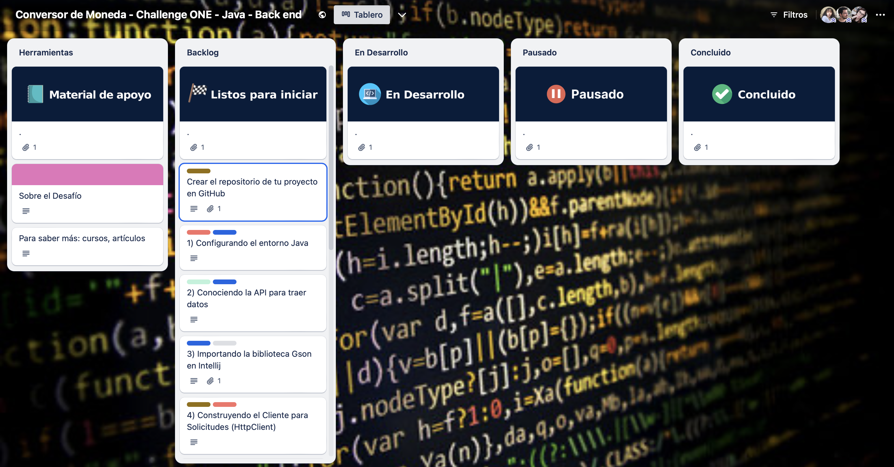
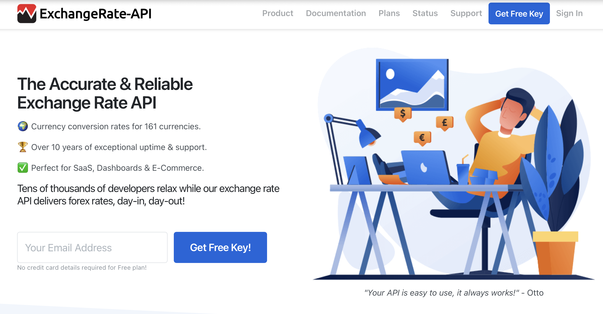

# Challenge Conversor de Monedas

Respositorio del primer desafío de la ruta "Desarrollador BackEnd" de Alura Latam y ORACLE ONE.

## Insignias

## Índice

* [Challenge Conversor de Monedas](#Challenge-Conversor-de-Monedas)

* [Insignias](#insignias)

* [Índice](#índice)

* [Descripción del proyecto](#Descripción-del-proyecto)

* [Estado del proyecto](#Estado-del-proyecto)

* [Características de la aplicación y demostración](#Características-de-la-aplicación-y-demostración)

* [Acceso al proyecto](#acceso-proyecto)

* [Tecnologías utilizadas](#tecnologías-utilizadas)

* [Desarrolladora del proyecto](#Desarrolladora-del-proyecto)

* [Licencia](#licencia)

* [Conclusiones](#conclusiones)

## Descripción del proyecto

En este emocionante desafío de programación, te invitamos a construir tu propio Conversor de Monedas. Aprenderás a realizar solicitudes a una API de tasas de cambio, a manipular datos JSON y, finalmente, a filtrar y mostrar las monedas de interés. ¡Prepárate para una experiencia práctica y emocionante en el desarrollo Java!

Los pasos para completar este desafío se detallarán a continuación:

* Configuración del Ambiente Java
* Creación del Proyecto
* Consumo de la API
* Análisis de la Respuesta JSON
* Filtro de Monedas
* Exibición de Resultados a los usuarios

Se trabajará con el sistema ágil de desarrollo, utilizando el Trello de la siguiente forma:

* La columna Listos para iniciar presenta las tarjetas con elementos que aun no fueron desarrollados.
* En la columna En Desarrollo estarán los elementos que estés desarrollando en el momento. Al iniciar una tarea, podrás mover la tarjeta que contiene dicha tarea para esta columna.
* En la columna Pausado estarán los elementos que comenzaste a desarrollar, pero necesitaste parar por algún motivo.
* Por fin, en la columna Concluido estarán los elementos ya concluidos.

Trello es una herramienta de uso individual para controlar el progreso de las actividades.

## Estado del proyecto

## Características de la aplicación y demostración

## Tecnologías utilizads

## ExchangeRate-API

## Desarrollador

| [  Nicole Lastra Quiroz ](https://github.com/Nicole-lq)|
| :---: |

## Licencia

## Conclusiones
